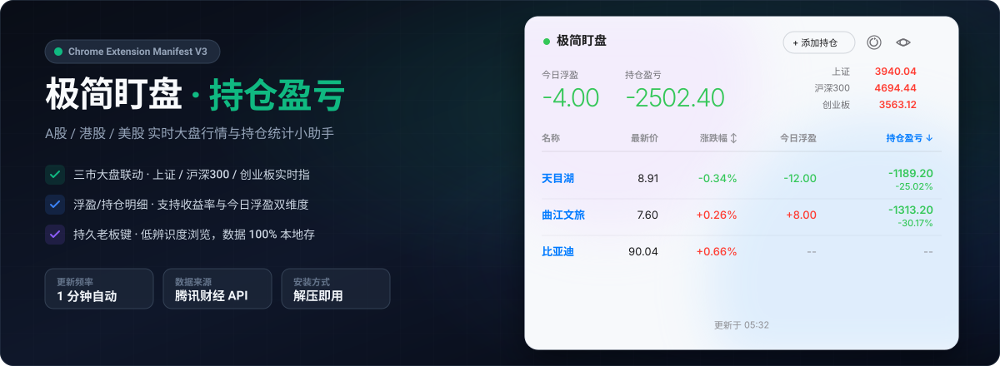
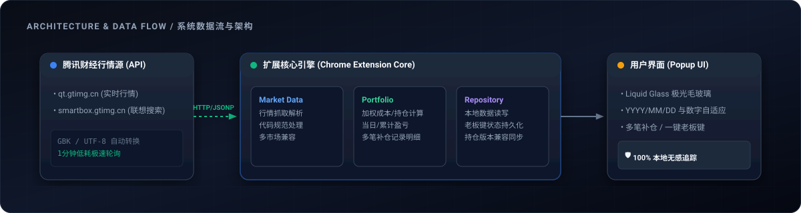

<div align="center">

  

  <br><br>

  [](https://developer.chrome.com/docs/extensions/mv3/intro/)
  [](LICENSE)
  [](https://qt.gtimg.cn)
  [](https://developer.chrome.com/docs/extensions/reference/storage/)

  <p align="center">
    <b>随时随地，随手一点。职场摸鱼盯盘·实时持仓盈亏监控利器。</b>
  </p>

</div>

---

## 🌟 什么是【极简盯盘】？

**极简盯盘-持仓盈亏**（View Your Holdings）是一款专为投资者与上班族设计的轻量级 Chrome 浏览器扩展。无需打开臃肿的交易软件或第三方网站，点击浏览器右上角插件图标，即可立刻查看您的 **A股、港股、美股** 实时行情、当日盈亏以及累计持仓收益。

内置专属 **“老板键”** 模式，一键切换为低辨识度的项目数据界面，保留浏览和刷新能力，并会记住启用状态。

---

## 🔥 核心痛点与独特优势

| 常见盯盘问题 | 极简盯盘的解决方案 |
| :--- | :--- |
| **软件臃肿**：开盘软件占用极高内存，频繁被弹窗干扰 | **极简轻量**：基于 Chrome Manifest V3 规范，毫秒级弹出，无任何广告 |
| **办公尴尬**：办公桌电脑屏幕大，被同事/领导看到持仓信息 | **老板键**：一键伪装为项目数据概览，主动退出前持续生效 |
| **数据分散**：同时持有 A 股、港股、美股，需要频繁切换界面 | **全市场支持**：统一看板整合 A 股 (`sh/sz`)、港股 (`hk`)、美股 (`gb_`) |
| **隐私安全**：担心持仓数据上传到第三方服务器泄露隐私 | **100% 本地**：所有持仓数据保存在浏览器 `chrome.storage`，零上传零泄露 |

---

## 🚀 功能特性

- 📊 **大盘指数速览**: 顶部集成 **上证指数、沪深300、创业板指数** 实时行情看板，大盘冷暖一目了然。
- 📈 **三地联动支持**: 全面支持 A股 (如 `sh600519`)、港股 (如 `hk00700`)、美股 (如 `gb_aapl`) 实时行情与检索。
- 💰 **双维度持仓精算**: 实时计算 **今日浮盈** 与 **持仓总盈亏**（含累计盈亏金额与收益率 %），盈亏明细清晰直观。
- 💼 **持久老板键**: 股票名称和持仓术语切换为项目数据表达，保留数值浏览、排序和刷新，关闭弹窗后仍保持伪装状态。
- ⚡ **自动极速轮询**: 交易时间内 1 分钟自动后台更新行情，并支持右上角一键手动刷新。
- 🔍 **智能拼音搜索**: 集成腾讯财经 SmartBox，支持中文名称、股票代码及拼音缩写一键搜素添加。

---

## 🏗️ 系统数据流与架构

扩展通过前端模块化解构，实现低耦合、高响应的极简架构：

<div align="center">
  
</div>

- **Market Data Adapter (`src/adapters/tencent-market-data.js`)**: 负责调用腾讯财经数据源并解析 GBK 行情与搜索结果。
- **Portfolio Domain Module (`src/domain/`)**: 统一股票代码、持仓成本、当日盈亏、累计收益与排序规则。
- **Holdings Repository Adapter (`src/adapters/holdings-repository.js`)**: 通过 `chrome.storage.local` 持久化版本化的设置与持仓数据。
- **Application / Popup View (`src/app/` / `src/ui/` / `src/main.js`)**: 编排行情刷新和持仓操作，并通过单一 ES Module 入口渲染现有界面。

---

## 📦 安装与使用指南

### 方法一：开发者模式解压加载（最快捷）

1. **下载源码**：克隆或下载本仓库 ZIP 压缩包到本地并解压。
   ```bash
   git clone https://github.com/your-username/ViewYourHoldings.git
   ```
2. **打开扩展管理页**：在 Chrome / Edge / Brave 等 Chromium 内核浏览器地址栏输入：
   ```text
   chrome://extensions/
   ```
3. **开启开发者模式**：勾选右上角的 **“开发者模式” (Developer mode)** 开关。
4. **加载已解压扩展**：点击左上角的 **“加载已解压的扩展程序” (Load unpacked)** 按钮。
5. **选择项目目录**：选择本项目所在的文件夹（包含 `manifest.json` 的目录）。
6. **固定图标**：点击浏览器右上角的扩展拼图图标 🧩，将 **【极简盯盘-持仓盈亏】** 固定到工具栏即可！

---

## 💡 快速使用教程

1. **添加持仓**：
   - 点击插件图标打开弹窗。
   - 在搜索框中输入股票名称（如 `贵州茅台`）或股票代码（如 `sh600519` / `hk00700` / `gb_aapl`）。
   - 点击搜索结果添加到列表。
2. **设置成本与数量**：
   - 点击列表中股票对应的 **编辑 (✏️)** 按钮。
   - 输入您的 **持仓数量** 与 **买入成本价** 并保存，系统将立刻计算出累计盈亏。
3. **开启老板键**：
   - 点击右上角的 **老板键**，即可切换为项目数据概览；再次点击“退出”才恢复正常界面。

---

## 🛠️ 技术栈

- **Core**: Vanilla JavaScript (ES6+), HTML5, CSS3
- **Platform**: Chrome Extensions Manifest V3
- **Data Provider**: 腾讯财经 API (`qt.gtimg.cn` / `smartbox.gtimg.cn`)
- **Storage**: `chrome.storage.local`

---

## 📄 开源许可证

本项目基于 [MIT License](LICENSE) 开源发布。自由使用，随心修改。
